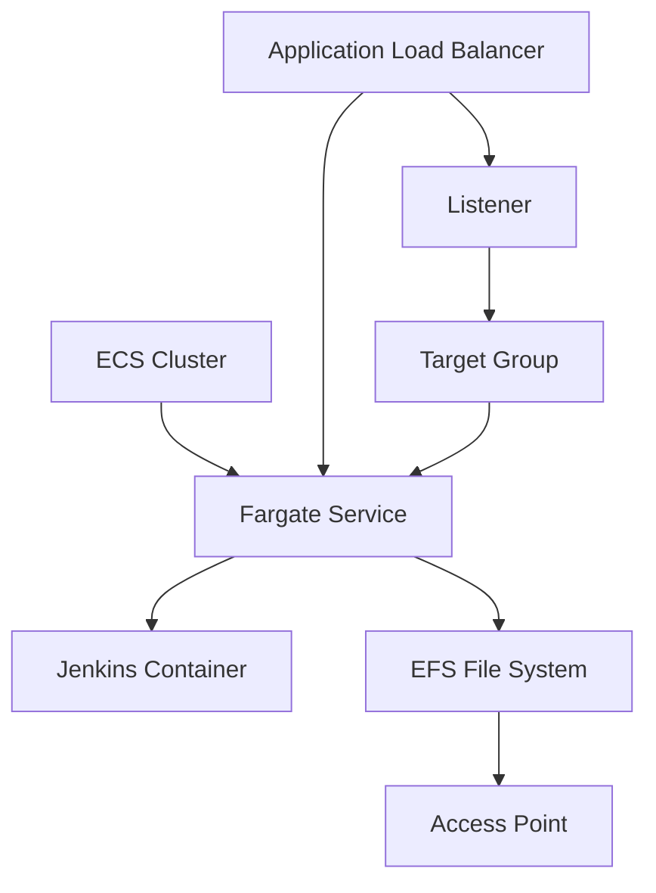

# Jenkins CDK Stack

This project includes a CDK stack to deploy a Jenkins server using AWS Fargate and EFS. The stack sets up the following resources:

- An ECS cluster.
- An EFS file system with an access point.
- A Fargate task definition with a Jenkins container.
- A Fargate service to run the Jenkins task.
- An Application Load Balancer to expose Jenkins.

The Jenkins home directory is stored on the EFS file system, ensuring data persistence across container restarts.

## CDK Constructs Diagram



## Setup and Deployment

To set up the virtual environment, install the required dependencies, and deploy the stack using CDK, follow these steps:

1. Create a virtual environment:

    On MacOS and Linux:
    ```
    $ python3 -m venv .venv
    ```

    On Windows:
    ```
    > python -m venv .venv
    ```

2. Activate the virtual environment:

    On MacOS and Linux:
    ```
    $ source .venv/bin/activate
    ```

    On Windows:
    ```
    > .venv\Scripts\activate.bat
    ```

3. Install the required dependencies:
    ```
    $ pip install -r requirements.txt
    ```

4. Deploy the CDK stack:
    ```
    $ cdk deploy
    ```

This will deploy the Jenkins server using AWS Fargate and EFS as described in the Jenkins CDK Stack section.

## Other Useful commands

 * `cdk ls`          list all stacks in the app
 * `cdk synth`       emits the synthesized CloudFormation template
 * `cdk deploy`      deploy this stack to your default AWS account/region
 * `cdk diff`        compare deployed stack with current state
 * `cdk docs`        open CDK documentation
